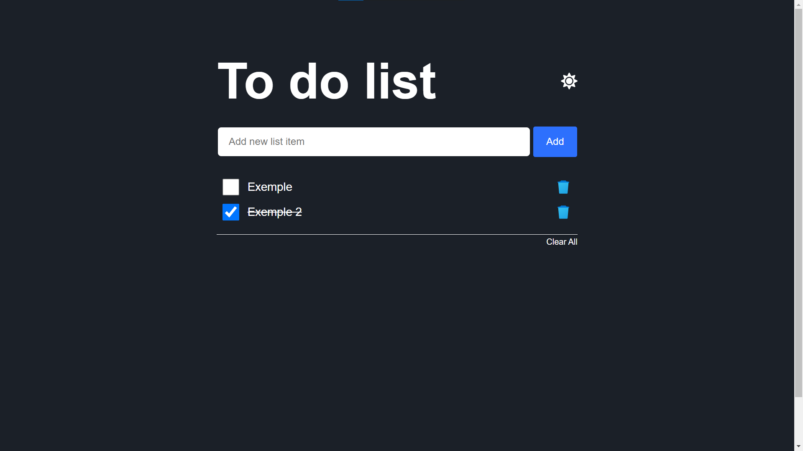

# Simple to do list

to-do list made only with HTML, CSS and javascript
## Functionalities

- Theme dark e light
- Add and remove tasks
- Remove all tasks

## Demonstration

> Press CTRL + click to open in new  tab

<a href="https://ronalt4cs.github.io/To-do-list/" target="_blank">Project link</a>

## Links

